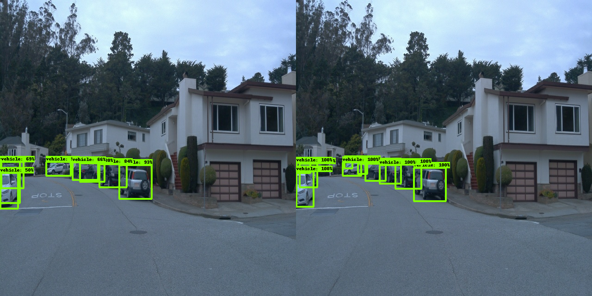
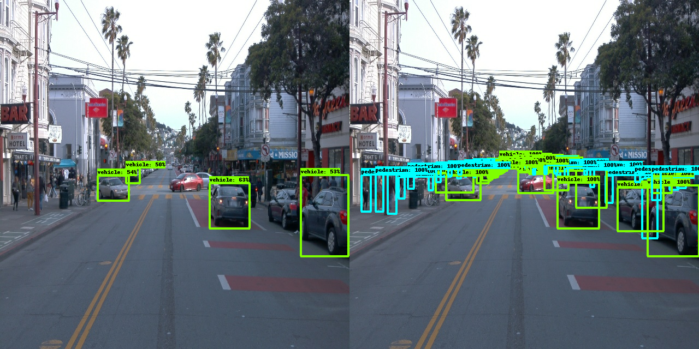
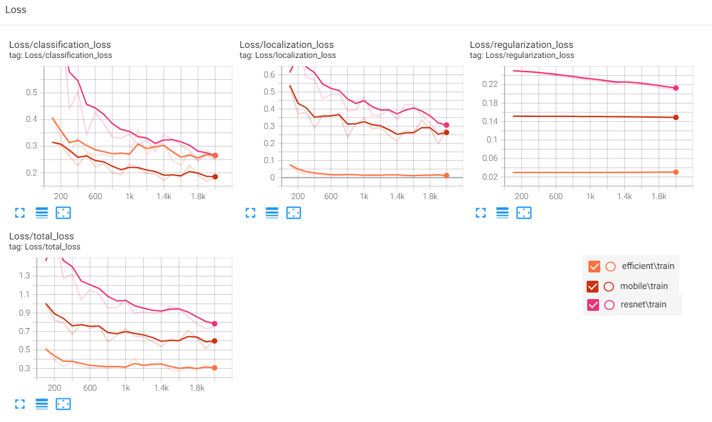

# Object Detection in Urban Environment
 
## Table Of Contents
- [Object Detection in Urban Environment](#object-detection-in-urban-environment)
  - [Table Of Contents](#table-of-contents)
  - [Introduction](#introduction)
  - [Dataset](#dataset)
  - [Methodology](#methodology)
    - [Training \& Deployment Process with AWS](#training--deployment-process-with-aws)
    - [Model Selection](#model-selection)
    - [Results](#results)
  - [Future Work \& Possible Improvement](#future-work--possible-improvement)

## Introduction
Utilizing transfer learning using TensorFlow object detection API and AWS Sagemaker to train models to detect and classify objects using data from the Waymo Open Dataset.

## Dataset
Front Camera Images from [Waymo Open Dataset](https://waymo.com/open/). 
Data are in **TFRecord** Format, the TFRecord format is a simple format for storing a sequence of binary records, which helps in data reading and processing efficiency.

## Methodology 
### Training & Deployment Process with AWS
- AWS Sagemaker for running Jupyter notebooks, training and deploying the model, and inference.
- AWS Elastic Container Registry (ECR) to build the Docker image and create the container required for running this project.
- AWS Simple Storage Service (S3) to save logs for creating visualizations. Also, the data for this project was stored in a public S3 bucket.

### Model Selection
For this project, I tested several object detection models using the Tensorflow Object Detection API. The models tested were:

|         **Model**        	|  **Config**  	|
|:------------------------:	|:------------:	|
| EfficientNet D1          	| [file](https://github.com/nagarjunvinukonda/urban-object-detection/blob/main/model1-efficientNet-default-training/pipeline.config) 	|
| SSD MobileNet V2 FPNLite 	| [file](https://github.com/nagarjunvinukonda/urban-object-detection/blob/main/model2-ssd-mobileNet/pipeline.config) 	|
| SSD ResNet50 V1 FPN       | [file](https://github.com/nagarjunvinukonda/urban-object-detection/blob/main/model3-resnet/pipeline.config) 	|

These pre-trained models are available in the TensorFlow 2 Object Detection Model Zoo, and they were trained on the COCO 2017 dataset. 
So,  their `pipeline.config` files need to be adjusted so TensorFlow 2 can find the `TFRecord` and `label_map.pbtxt` files when they are loaded inside the container from Amazon S3.
 
Since the Waymo dataset has only 3 classes, Cars, Pedestrians, and Cyclists, the `pipeline.config` was adjusted to our problem instead of the 90 classes that were there for the COCO dataset.

For the 3 Models I used a fixed number of training steps which is **2000**, this was due to my limited AWS budget.

Also, I used Momentum Optimizer with the same batch size of **8** in the 3 experiments, for the same reason.

### Results
Each model was evaluated using the mAP metric, which measures the accuracy of the model in detecting objects. The mAP is calculated based on the precision and recall of the model at different IoU (Intersection over Union) thresholds.

Tensorboard was used to visualize the training loss and validation mAP for each model. From the Tensorboard graphs, we observed that the models showed similar patterns in terms of training loss, but differed in their ability to generalize to the test data.

|                                       	|                        EfficientNet D1                       	|                 SSD MobileNet V2 FPNLite               	|                   SSD ResNet50 V1 FPN                 	|
|:-------------------------------------:	|:------------------------------------------------------------:	|:------------------------------------------------------:	|:-----------------------------------------------------:	|
|        **mAP@ (0.5:0.95) IOU**        	|                             0.0938                           	|                         **0.09543**                    	|                         0.05755                       	|
|             **mAP@.50IOU**            	|                             **0.2253**                        |                          0.2234                        	|                         0.1248                        	|
|             **mAP@.75IOU**            	|                             0.0668                           	|                          **0.071**                        |                         0.04505                       	|
|        **mAP (small objects)**        	|                            0.01484                           	|                          **0.0392**                       |                         0.02317                       	|
|        **mAP (medium objects)**       	|                             **0.364**                         |                          0.3383                        	|                         0.2107                        	|
|        **mAP (large objects)**        	|                             **0.839**                         |                          0.4531                        	|                         0.1917                        	|
| **Predicted Vs Ground Truth Sample** 	|         	|         	|         	|
|               **Video**               	|                          	|                       	|                       	|

Based on the evaluation of three object detection models in an urban environment, the SSD MobileNet V2 FPNLite model demonstrated the highest performance, achieving an mAP@(0.5:0.05:0.95) IOU of 0.09543, surpassing both the EfficientNet D1 and SSD ResNet50 V1 FPN models.  

When it came to detecting smaller objects, such as cyclists and pedestrians, the SSD MobileNet V2 FPNLite model also exhibited the highest mean Average Precision (mAP), indicating its superior capability in identifying smaller objects compared to the other models. On the other hand, the EfficientNet D1 model achieved the highest mAP for larger objects, which suggests it may excel in detecting larger objects like nearby cars.  

All three models struggled with detecting cyclists, which could be attributed to the dataset's imbalance, as cars were the most represented class, while cyclists were the least frequent.  

In conclusion, the model selection process revealed that each model has unique strengths and weaknesses in object detection, making it important to choose the appropriate model based on the specific application and the nature of the objects being detected. The results also indicate that the ResNet50 model may not be the optimal choice for urban object detection without further tuning and optimization.  

Here are the training losses of the 3 experiments:

Only EfficientNet:

Only MobileNet:

The plots show that the 3 models could achieve better loss if we increased the n. of training steps because there is room for convergence.

## Future Work & Possible Improvement

We identified several areas where performance could be enhanced, although these would require additional resources and a larger computing budget. Key opportunities for improvement include:
- Extending Training Steps: The models were trained for only 2000 steps, which is relatively low for this type of data and complex architectures. Increasing the number of training steps until the loss stabilizes could lead to better performance.
- Data Augmentation: Basic techniques such as flipping, scaling, and random cropping were used, but more advanced methods like color jittering, rotation, and translation could further enhance model accuracy.
- Hyperparameter Tuning: Fine-tuning hyperparameters could lead to significant performance gains.
- Addressing Occlusion and Partial Object Detection: This project focused on detecting complete objects, but in urban environments, objects are often partially occluded. Developing techniques to handle partial object detection could further improve the model's effectiveness.

## Understanding the losses and MAP for ResNet and SSD-MobileNet:

# For MobileResNet:

# loss reduction:
INFO:tensorflow:Eval metrics at step 2000  
I0903 01:20:39.865125 140552185530176 model_lib_v2.py:1015 Eval metrics at step 2000  
INFO:tensorflow:#011+ DetectionBoxes_Precision/mAP: 0.010797  
I0903 01:20:39.911026 140552185530176 model_lib_v2.py:1018 #011+ DetectionBoxes_Precision/mAP: 0.010797  
INFO:tensorflow:#011+ DetectionBoxes_Precision/mAP@.50IOU: 0.030894  
I0903 01:20:39.912400 140552185530176 model_lib_v2.py:1018 #011+ DetectionBoxes_Precision/mAP@.50IOU: 0.030894  
INFO:tensorflow:#011+ DetectionBoxes_Precision/mAP@.75IOU: 0.005249  
I0903 01:20:39.913335 140552185530176 model_lib_v2.py:1018 #011+ DetectionBoxes_Precision/mAP@.75IOU: 0.005249  
INFO:tensorflow:#011+ DetectionBoxes_Precision/mAP (small): 0.004347  
I0903 01:20:39.914260 140552185530176 model_lib_v2.py:1018 #011+ DetectionBoxes_Precision/mAP (small): 0.004347  
INFO:tensorflow:#011+ DetectionBoxes_Precision/mAP (medium): 0.046629  
I0903 01:20:39.915236 140552185530176 model_lib_v2.py:1018 #011+ DetectionBoxes_Precision/mAP (medium): 0.046629  
INFO:tensorflow:#011+ DetectionBoxes_Precision/mAP (large): 0.058190  
I0903 01:20:39.916234 140552185530176 model_lib_v2.py:1018 #011+ DetectionBoxes_Precision/mAP (large): 0.058190  
INFO:tensorflow:#011+ DetectionBoxes_Recall/AR@1: 0.006363  
I0903 01:20:39.917206 140552185530176 model_lib_v2.py:1018 #011+ DetectionBoxes_Recall/AR@1: 0.006363  
INFO:tensorflow:#011+ DetectionBoxes_Recall/AR@10: 0.022276  
I0903 01:20:39.918152 140552185530176 model_lib_v2.py:1018 #011+ DetectionBoxes_Recall/AR@10: 0.022276  
INFO:tensorflow:#011+ DetectionBoxes_Recall/AR@100: 0.046924  
I0903 01:20:39.919075 140552185530176 model_lib_v2.py:1018 #011+ DetectionBoxes_Recall/AR@100: 0.046924  
INFO:tensorflow:#011+ DetectionBoxes_Recall/AR@100 (small): 0.015385  
I0903 01:20:39.919990 140552185530176 model_lib_v2.py:1018 #011+ DetectionBoxes_Recall/AR@100 (small): 0.015385  
INFO:tensorflow:#011+ DetectionBoxes_Recall/AR@100 (medium): 0.158095  
I0903 01:20:39.920982 140552185530176 model_lib_v2.py:1018 #011+ DetectionBoxes_Recall/AR@100 (medium): 0.158095  
INFO:tensorflow:#011+ DetectionBoxes_Recall/AR@100 (large): 0.277091  
I0903 01:20:39.922000 140552185530176 model_lib_v2.py:1018 #011+ DetectionBoxes_Recall/AR@100 (large): 0.277091  
INFO:tensorflow:#011+ Loss/localization_loss: 0.742506  
I0903 01:20:39.922835 140552185530176 model_lib_v2.py:1018 #011+ Loss/localization_loss: 0.742506  
INFO:tensorflow:#011+ Loss/classification_loss: 0.662821  
I0903 01:20:39.923635 140552185530176 model_lib_v2.py:1018 #011+ Loss/classification_loss: 0.662821  
INFO:tensorflow:#011+ Loss/regularization_loss: 0.723049  
I0903 01:20:39.924386 140552185530176 model_lib_v2.py:1018 #011+ Loss/regularization_loss: 0.723049  
INFO:tensorflow:#011+ Loss/total_loss: 2.128375  
I0903 01:20:39.925155 140552185530176 model_lib_v2.py:1018 #011+ Loss/total_loss: 2.128375  
INFO:tensorflow:Waiting for new checkpoint at /opt/training  
I0903 01:24:42.505243 140552185530176 checkpoint_utils.py:168 Waiting for new checkpoint at /opt/training  
INFO:tensorflow:Timed-out waiting for a checkpoint.  
I0903 01:24:51.515754 140552185530176 checkpoint_utils.py:231 Timed-out waiting for a checkpoint.  
creating index...  
index created!  
creating index...  

# MAP:

 Average Precision  (AP) @[ IoU=0.50:0.95 | area=   all | maxDets=100 ] = 0.011  
 Average Precision  (AP) @[ IoU=0.50      | area=   all | maxDets=100 ] = 0.031  
 Average Precision  (AP) @[ IoU=0.75      | area=   all | maxDets=100 ] = 0.005  
 Average Precision  (AP) @[ IoU=0.50:0.95 | area= small | maxDets=100 ] = 0.004  
 Average Precision  (AP) @[ IoU=0.50:0.95 | area=medium | maxDets=100 ] = 0.047  
 Average Precision  (AP) @[ IoU=0.50:0.95 | area= large | maxDets=100 ] = 0.058  
 Average Recall     (AR) @[ IoU=0.50:0.95 | area=   all | maxDets=  1 ] = 0.006  
 Average Recall     (AR) @[ IoU=0.50:0.95 | area=   all | maxDets= 10 ] = 0.022  
 Average Recall     (AR) @[ IoU=0.50:0.95 | area=   all | maxDets=100 ] = 0.047  
 Average Recall     (AR) @[ IoU=0.50:0.95 | area= small | maxDets=100 ] = 0.015  
 Average Recall     (AR) @[ IoU=0.50:0.95 | area=medium | maxDets=100 ] = 0.158  
 Average Recall     (AR) @[ IoU=0.50:0.95 | area= large | maxDets=100 ] = 0.277  
creating index...  
index created!  
creating index...  
index created!  
Running per image evaluation...  
Evaluate annotation type *bbox*  
DONE (t=8.72s).  
Accumulating evaluation results...  
DONE (t=0.22s).  
 Average Precision  (AP) @[ IoU=0.50:0.95 | area=   all | maxDets=100 ] = 0.011  
 Average Precision  (AP) @[ IoU=0.50      | area=   all | maxDets=100 ] = 0.031  
 Average Precision  (AP) @[ IoU=0.75      | area=   all | maxDets=100 ] = 0.005  
 Average Precision  (AP) @[ IoU=0.50:0.95 | area= small | maxDets=100 ] = 0.004  
 Average Precision  (AP) @[ IoU=0.50:0.95 | area=medium | maxDets=100 ] = 0.047  
 Average Precision  (AP) @[ IoU=0.50:0.95 | area= large | maxDets=100 ] = 0.058  
 Average Recall     (AR) @[ IoU=0.50:0.95 | area=   all | maxDets=  1 ] = 0.006  
 Average Recall     (AR) @[ IoU=0.50:0.95 | area=   all | maxDets= 10 ] = 0.022  
 Average Recall     (AR) @[ IoU=0.50:0.95 | area=   all | maxDets=100 ] = 0.047  
 Average Recall     (AR) @[ IoU=0.50:0.95 | area= small | maxDets=100 ] = 0.015  
 Average Recall     (AR) @[ IoU=0.50:0.95 | area=medium | maxDets=100 ] = 0.158  
 Average Recall     (AR) @[ IoU=0.50:0.95 | area= large | maxDets=100 ] = 0.277  
  
2024-09-03 01:25:52 Completed - Training job completed  
Training seconds: 1420  
Billable seconds: 1420  

# For MobileNet:  
For the 200 steps my training loss has decreased very well  

I0902 20:43:12.704892 139656122832704 model_lib_v2.py:1015 Eval metrics at step 2000  
INFO:tensorflow:#011+ DetectionBoxes_Precision/mAP: 0.104386  
I0902 20:43:12.749567 139656122832704 model_lib_v2.py:1018 #011+ DetectionBoxes_Precision/mAP: 0.104386  
INFO:tensorflow:#011+ DetectionBoxes_Precision/mAP@.50IOU: 0.226448  
I0902 20:43:12.750918 139656122832704 model_lib_v2.py:1018 #011+ DetectionBoxes_Precision/mAP@.50IOU: 0.226448  
INFO:tensorflow:#011+ DetectionBoxes_Precision/mAP@.75IOU: 0.089791  
I0902 20:43:12.751879 139656122832704 model_lib_v2.py:1018 #011+ DetectionBoxes_Precision/mAP@.75IOU: 0.089791  
INFO:tensorflow:#011+ DetectionBoxes_Precision/mAP (small): 0.041402  
I0902 20:43:12.752855 139656122832704 model_lib_v2.py:1018 #011+ DetectionBoxes_Precision/mAP (small): 0.041402  
INFO:tensorflow:#011+ DetectionBoxes_Precision/mAP (medium): 0.381179  
I0902 20:43:12.753796 139656122832704 model_lib_v2.py:1018 #011+ DetectionBoxes_Precision/mAP (medium): 0.381179  
INFO:tensorflow:#011+ DetectionBoxes_Precision/mAP (large): 0.464602  
I0902 20:43:12.754795 139656122832704 model_lib_v2.py:1018 #011+ DetectionBoxes_Precision/mAP (large): 0.464602  
INFO:tensorflow:#011+ DetectionBoxes_Recall/AR@1: 0.026778  
I0902 20:43:12.755791 139656122832704 model_lib_v2.py:1018 #011+ DetectionBoxes_Recall/AR@1: 0.026778  
INFO:tensorflow:#011+ DetectionBoxes_Recall/AR@10: 0.110649  
I0902 20:43:12.756803 139656122832704 model_lib_v2.py:1018 #011+ DetectionBoxes_Recall/AR@10: 0.110649  
INFO:tensorflow:#011+ DetectionBoxes_Recall/AR@100: 0.155262  
I0902 20:43:12.757821 139656122832704 model_lib_v2.py:1018 #011+ DetectionBoxes_Recall/AR@100: 0.155262  
INFO:tensorflow:#011+ DetectionBoxes_Recall/AR@100 (small): 0.092211  
I0902 20:43:12.758812 139656122832704 model_lib_v2.py:1018 #011+ DetectionBoxes_Recall/AR@100 (small): 0.092211  
INFO:tensorflow:#011+ DetectionBoxes_Recall/AR@100 (medium): 0.480428  
I0902 20:43:12.759800 139656122832704 model_lib_v2.py:1018 #011+ DetectionBoxes_Recall/AR@100 (medium): 0.480428  
INFO:tensorflow:#011+ DetectionBoxes_Recall/AR@100 (large): 0.487738  
I0902 20:43:12.760971 139656122832704 model_lib_v2.py:1018 #011+ DetectionBoxes_Recall/AR@100 (large): 0.487738  
INFO:tensorflow:#011+ Loss/localization_loss: 0.477937  
I0902 20:43:12.761734 139656122832704 model_lib_v2.py:1018 #011+ Loss/localization_loss: 0.477937  
INFO:tensorflow:#011+ Loss/classification_loss: 0.298156  
I0902 20:43:12.762511 139656122832704 model_lib_v2.py:1018 #011+ Loss/classification_loss: 0.298156  
INFO:tensorflow:#011+ Loss/regularization_loss: 0.148691  
I0902 20:43:12.763284 139656122832704 model_lib_v2.py:1018 #011+ Loss/regularization_loss: 0.148691  
INFO:tensorflow:#011+ Loss/total_loss: 0.924784  
I0902 20:43:12.764048 139656122832704 model_lib_v2.py:1018 #011+ Loss/total_loss: 0.924784  

# This is my model MAP: 
    
 Average Precision  (AP) @[ IoU=0.50:0.95 | area=   all | maxDets=100 ] = 0.104  
 Average Precision  (AP) @[ IoU=0.50      | area=   all | maxDets=100 ] = 0.226  
 Average Precision  (AP) @[ IoU=0.75      | area=   all | maxDets=100 ] = 0.090  
 Average Precision  (AP) @[ IoU=0.50:0.95 | area= small | maxDets=100 ] = 0.041  
 Average Precision  (AP) @[ IoU=0.50:0.95 | area=medium | maxDets=100 ] = 0.381  
 Average Precision  (AP) @[ IoU=0.50:0.95 | area= large | maxDets=100 ] = 0.465  
 Average Recall     (AR) @[ IoU=0.50:0.95 | area=   all | maxDets=  1 ] = 0.027  
 Average Recall     (AR) @[ IoU=0.50:0.95 | area=   all | maxDets= 10 ] = 0.111  
 Average Recall     (AR) @[ IoU=0.50:0.95 | area=   all | maxDets=100 ] = 0.155  
 Average Recall     (AR) @[ IoU=0.50:0.95 | area= small | maxDets=100 ] = 0.092  
 Average Recall     (AR) @[ IoU=0.50:0.95 | area=medium | maxDets=100 ] = 0.480  
 Average Recall     (AR) @[ IoU=0.50:0.95 | area= large | maxDets=100 ] = 0.488  

Training seconds: 1053  
Billable seconds: 1053  
